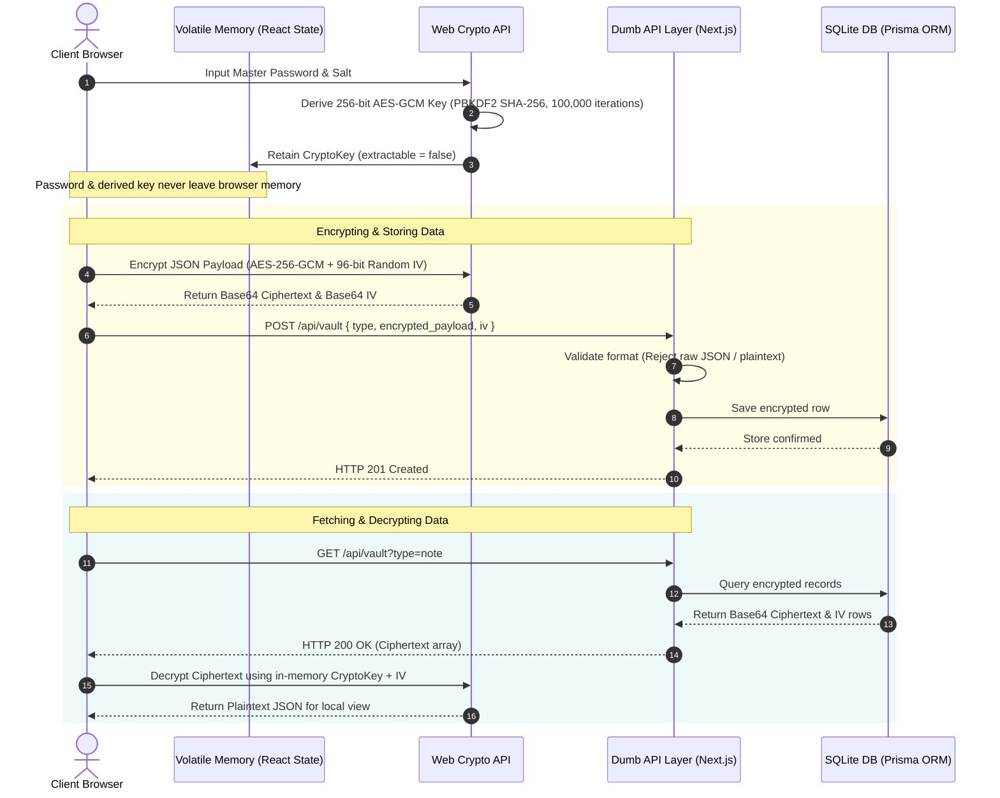

# Zero-Knowledge SaaS Starter Kit - Client-Side Encrypted Boilerplate for Next.js

> **Production-grade, commercial developer starter kit for building privacy-first SaaS applications with native Web Crypto API, Next.js App Router, Prisma ORM, and Neo-Brutalist UI styling.**

---

## 🛡️ The Architecture (How it Works)

The core architectural guarantee of this template is **Zero-Knowledge Data Security**: the server and database **never** receive master passwords, key derivation material, or unencrypted data.

### Cryptographic Workflow Diagram



### Detailed Cryptographic Specifications

1. **Key Derivation (PBKDF2)**:
   - Algorithm: `PBKDF2` with `SHA-256`
   - Iteration Count: `100,000` iterations (NIST compliant)
   - Output: 256-bit `AES-GCM` `CryptoKey` object (`extractable = false`)
   - File Location: `lib/crypto/keyDerivation.ts`

2. **Payload Encryption (AES-256-GCM)**:
   - Algorithm: `AES-GCM` (256-bit key length)
   - Initialization Vector (IV): Cryptographically secure 12-byte (96-bit) random IV generated per payload via `window.crypto.getRandomValues`.
   - Output: Base64-encoded `ciphertext` and Base64-encoded `iv`.
   - File Location: `lib/crypto/encryption.ts`

3. **Volatile Memory Storage & SSR Safeguard**:
   - The derived `CryptoKey` is retained strictly in volatile React component state (`hooks/useCrypto.ts`).
   - It is **never** written to `localStorage`, `sessionStorage`, `cookies`, or sent over HTTP.
   - If the user reloads or closes the page, the key memory is zeroed out instantly, prompting for re-authentication.

4. **Dumb API Layer Validation**:
   - The API route (`app/api/vault/route.ts`) inspects incoming payloads to ensure they are stringified Base64 ciphertext buffers and explicitly rejects raw JSON objects or plaintext strings.

---

## 🚀 Local Setup

Follow these simple steps to run the boilerplate locally:

### Option A: Local Node.js Development (Port 3000)

#### Prerequisites
- **Node.js**: v18.x or higher
- **npm**: v9.x or higher

#### Step 1: Install Dependencies
```bash
npm install
```

#### Step 2: Push Prisma Database Schema (SQLite)
```bash
npx prisma db push
```
This generates the SQLite database at `prisma/dev.db` and compiles the Prisma Client.

#### Step 3: Start Development Server
```bash
npm run dev
```
Open [http://localhost:3000](http://localhost:3000) in your browser.

---

### Option B: Production Containerization via Docker (Port 4000)

The project includes a multi-stage `Dockerfile` and `docker-compose.yml` leveraging Next.js `standalone` mode to minimize image overhead.

> **Port Mapping Note**: Docker Compose maps host **port 4000** (`4000:3000`) by default. This avoids port collisions with local Node dev servers running on port `3000` and bypasses OS-level port exclusion ranges (such as Windows Hyper-V dynamic port reservations from 2947 to 3146). If you wish to change the host port, set `APP_PORT=8080` in your environment.

#### Build & Run via Docker Compose
```bash
# Build and launch standalone containerized application on http://localhost:4000
docker compose up -d --build
```
Open [http://localhost:4000](http://localhost:4000) in your browser.

#### Stop Container
```bash
docker compose down
```

The database volume is persisted locally inside the Docker volume `sqlite-data` across container restarts.

---

## 📦 Included Demos & Use Cases

This starter kit includes three distinct UI demos to prove the flexibility of the cryptography engine. Because the encryption hook accepts standard JSON, you can use this foundation for virtually any SaaS application.

### 1. Secure Notes
A standard encrypted text pad. Demonstrates how to take a simple string input, encrypt it on the client, and store it safely in the database.

### 2. Password Vault
A full password manager interface. Demonstrates combining multiple inputs (URL, Username, Password) into a single encrypted payload, keeping credentials completely hidden from the server. Includes an integrated client-side high-entropy password generator.

### 3. Secret File Metadata Index (The Zero-Knowledge Drive Simulator)
**Note: This demo does not handle physical file uploads (e.g., to AWS S3). It demonstrates something much more critical: The Database Index Layer.**

In a true zero-knowledge cloud drive, you cannot store file names, sizes, or tags in plaintext in your database. This demo shows how to securely store a File Index:
1. The user inputs file metadata (e.g., `fileName: "tax_2025.pdf"`, `size: 1048576`, `storagePointer: "s3://..."`).
2. React bundles this into a standard JSON object.
3. The `useCrypto` hook encrypts the *entire JSON object* into a single ciphertext string.
4. The server stores the unreadable string.

By understanding this demo, you can easily adapt this starter kit to build encrypted CRMs, secure medical record databases, or private legal document indexes.

---

## 🔌 API Endpoints Reference

The backend API (`app/api/vault/route.ts`) acts as a zero-knowledge relay:

| Method | Endpoint | Description | Query / Body Params |
|---|---|---|---|
| `POST` | `/api/vault` | Store encrypted payload row | `{ type, encrypted_payload, iv, user_id? }` |
| `GET` | `/api/vault` | Fetch encrypted records | `?type=note` or `?type=password` or `?type=file_metadata` |
| `DELETE` | `/api/vault` | Delete encrypted entry by ID | `?id=<vault_row_id>` |

---

## 👁️ Visual Proof & Network Inspection

You can independently verify that your server receives zero plaintext data during any store or save operation:

1. Open your browser and navigate to `http://localhost:3000` (Local) or `http://localhost:4000` (Docker).
2. Unlock your vault with a master password.
3. Open your browser Developer Tools (`F12` or `Cmd+Option+I`) and switch to the **Network** tab.
4. Filter network requests by `fetch` or `XHR`.
5. Select any demo (e.g. **Secure Notes**) and click **Encrypt & Store Note**.
6. Inspect the `POST /api/vault` request payload:

```json
{
  "user_id": "demo-user-default",
  "type": "note",
  "encrypted_payload": "8f3a1b9c1d2e...",
  "iv": "4k2j9s1d8f3a..."
}
```

Notice that the request body contains **only Base64-encoded ciphertext** and the **Initialization Vector (IV)**. No plaintext title, body, credentials, or encryption keys ever touch the network wire.

---

## 🎨 Design System: Neo-Brutalism

This template features a custom, high-contrast **Neo-Brutalist** design system configured in `app/globals.css`:
- **Borders**: Heavy 3px/4px solid black outlines (`border-3 border-black`).
- **Shadows**: Hard-offset box-shadows (`shadow-[4px_4px_0px_0px_rgba(0,0,0,1)]`).
- **Color Palette**: Electric Yellow (`#FFE600`), Neon Pink (`#FF6B6B`), Cyan (`#4ECDC4`), and Lime Green (`#A8FF35`).
- **Typography**: Monospace accents paired with heavy, bold headings.

---

## ⚡ DevOps & CI/CD

### GitHub Actions Pipeline
Every push or pull request targeting the `main` branch automatically triggers our GitHub Actions pipeline (`.github/workflows/ci.yml`):
- Sets up Node.js v20 with dependency caching.
- Executes `npm ci` for deterministic clean installs.
- Runs `npx prisma generate` to verify schema compilation.
- Audits code quality with `npm run lint`.
- Verifies Next.js standalone build generation (`npm run build`).

---

## ⚠️ License & Terms of Use (Read First)

By using this template, you agree to the following terms:
* **Provided As-Is**: This template is sold "as-is." It is a foundational boilerplate for developers, an educational starting point, not a formally audited security product.
* **No Technical Support**: To keep this product affordable, 1-on-1 technical support, debugging, and future updates are not included. 
* **No Refunds**: Because this is a direct digital download, all sales are strictly final.
* **Allowed Usage**: You may use this code to build unlimited personal or commercial projects. You may not resell, redistribute, or repackage this template as a competing digital product.